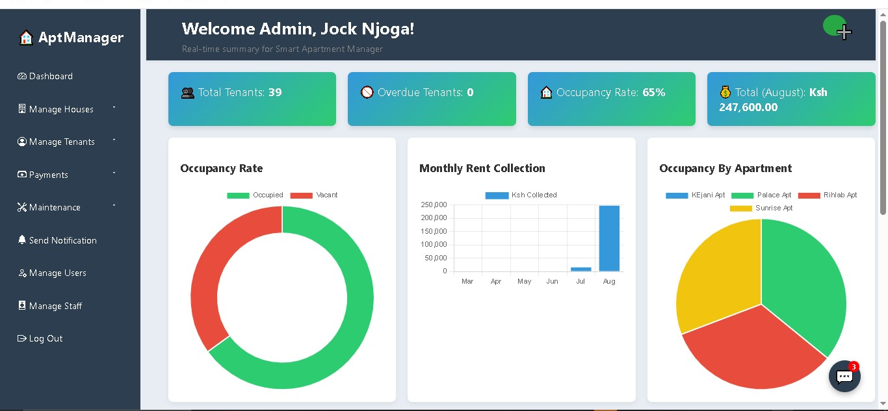
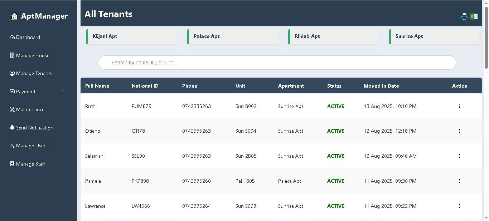
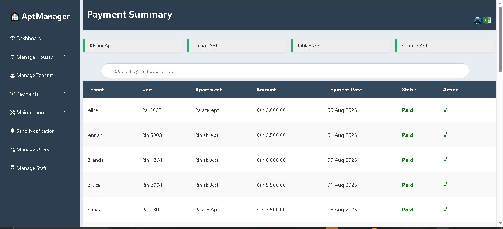

# 🏢 Apartment Management System

A full-featured web application for managing apartments, units, tenants, rent payments, and maintenance requests — with a built-in **floating chatbot** for tenant communication and **automated monthly rent generation**.

---

## 📌 Features
### 🔹 Apartment Management
-Add Apartment,edit and delete.

### 🔹 Tenant & Unit Management
- Add, edit, and remove tenants with rental agreements.
- Track vacant and occupied units by house type.
- Assign and unassign tenants to units dynamically.

### 🔹 Rent Payment Management
- Record and track monthly rent payments.
- **One-click Monthly Payment Generation**: At the start of every month, the admin can click a button to automatically create rent payment entries for all active tenants, saving time.
- View outstanding balances and full payment history.

### 🔹 Maintenance Requests
- Tenants submit issues from their portal.
- Admins update status (Pending → In Progress → Completed).
- History of completed requests stored for each unit.

### 🔹 Floating Chatbot on Dashboard
- Appears as a small chat icon on every admin and tenant dashboard.
- **Tenants**: Can send messages directly to the apartment manager.
- **Admin**: Receives all tenant messages in a unified inbox, with the ability to reply to each tenant individually.
- Works like a group chat on the admin side but private 1-to-1 conversations on the tenant side.
- Supports real-time messaging (via AJAX) without page reload.

### 🔹 Dynamic Dashboard
- Real-time stats on total units, vacancies, occupied units, and rent collection.
- Quick links to major actions like adding tenants, viewing payments, and generating rent.

---

## 🖼️ Screenshots

| Dashboard | Tenant | Payment Page |
|-----------|---------|--------------|
|  |  |  |

---

## ⚙️ Installation

### 1️⃣ Requirements
- [XAMPP](https://www.apachefriends.org/) or [WAMP](https://www.wampserver.com/)  
- PHP 7.4 or higher  
- MySQL 5.7 or higher  
- Web browser

### 2️⃣ Steps to Setup
1. Clone or download this repository.
   ```bash
   git clone https://github.com/jocknjoga/apartment-management-system.git
